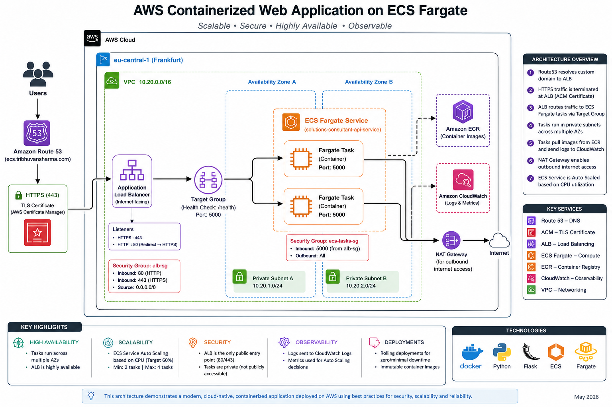

# AWS Containerized Web Application on ECS Fargate

## Overview

This project demonstrates a scalable, secure, and highly available containerized web application deployed on AWS using ECS Fargate.

The application is packaged using Docker, stored in Amazon ECR, and deployed as private ECS Fargate tasks behind an Application Load Balancer (ALB). The architecture follows modern cloud-native deployment principles including immutable deployments, private networking, centralized logging, health-based traffic routing, and auto scaling.

This project was designed to strengthen hands-on understanding of:

* Docker containerization
* ECS/Fargate orchestration
* Cloud-native deployment workflows
* AWS networking and security
* Load balancing and health checks
* Rolling deployments
* ECS auto scaling
* Observability using CloudWatch

The project focuses primarily on infrastructure architecture, orchestration, and deployment workflows rather than application business logic.

---

# Live Application

**URL:** [https://ecs.tribhuvansharma.com](https://ecs.tribhuvansharma.com)

---

# Application Preview

## Frontend Overview

The application now includes a lightweight frontend served directly from the Flask container running on ECS Fargate.

The frontend consumes backend API endpoints and visually presents:

* profile information
* architecture highlights
* deployment details
* health status
* live API response

This keeps the project infrastructure-focused while still providing a polished user-facing experience.

---

# Architecture Diagram



---

# Final Architecture

User
→ Route53
→ HTTPS (ACM)
→ Application Load Balancer
→ ECS Fargate Service
→ Private ECS Tasks

Supporting Services:

* Amazon ECR
* Amazon CloudWatch Logs
* AWS IAM
* AWS VPC
* NAT Gateway
* Security Groups
* ECS Service Auto Scaling

---

# Architecture Components

## 1. Presentation & Traffic Layer

### Amazon Route53

Used for DNS management and custom domain routing.

Configured subdomain:

```text
https://ecs.tribhuvansharma.com
```

### AWS Certificate Manager (ACM)

Provides TLS certificate for HTTPS encryption.

### Application Load Balancer (ALB)

Acts as the public entry point into the architecture.

Responsibilities:

* HTTPS termination
* HTTP → HTTPS redirect
* Routing traffic to ECS tasks
* Health checks using `/health`
* Distributing traffic across multiple tasks and AZs

The ALB is deployed in public subnets.

---

## 2. Application Layer

### Amazon ECS

Used for container orchestration.

The ECS Service:

* Maintains desired running task count
* Replaces unhealthy tasks automatically
* Performs rolling deployments
* Integrates with ALB target groups
* Supports auto scaling

### AWS Fargate

Provides serverless container runtime.

No EC2 instance management is required.

AWS manages:

* underlying compute
* scaling infrastructure
* runtime environment
* server maintenance

### Docker Container

The Flask application is containerized using Docker.

The application exposes:

* `/`
* `/health`

Container port:

```text
5000
```

---

## 3. Networking & Security Layer

### Amazon VPC

Dedicated VPC created specifically for the ECS architecture.

CIDR Block:

```text
10.20.0.0/16
```

### Public Subnets

Contain:

* Application Load Balancer
* NAT Gateway

### Private Subnets

Contain:

* ECS Fargate Tasks

Tasks are intentionally deployed privately and are not directly internet accessible.

### NAT Gateway

Allows private ECS tasks to:

* pull images from ECR
* send logs to CloudWatch
* access outbound internet services

without exposing tasks publicly.

### Security Groups

#### ALB Security Group (`alb-sg`)

Inbound:

* HTTP (80)
* HTTPS (443)

Source:

```text
0.0.0.0/0
```

#### ECS Task Security Group (`ecs-task-sg`)

Inbound:

* TCP 5000

Source:

```text
alb-sg
```

This ensures ECS tasks only accept traffic from the ALB.

---

## 4. Container Registry

### Amazon ECR

Stores Docker container images.

Deployment flow:

```text
Docker Build
→ Tag Image
→ Push to ECR
→ ECS pulls image during deployment
```

---

## 5. Observability & Monitoring

### Amazon CloudWatch Logs

Used for centralized container logging.

Logs include:

* Flask application logs
* ALB health check requests
* ECS runtime output

Example health check log:

```text
GET /health HTTP/1.1 200
```

---

# Auto Scaling Configuration

ECS Service Auto Scaling configured using:

* Target Tracking Policy
* CPU Utilization metric

Scaling configuration:

| Setting                | Value |
| ---------------------- | ----- |
| Minimum Tasks          | 2     |
| Maximum Tasks          | 4     |
| Target CPU Utilization | 60%   |

The ECS service dynamically adjusts task count based on workload demand.

---

# Rolling Deployments

The application supports immutable rolling deployments.

Deployment workflow:

```text
Modify Code
→ Build New Docker Image
→ Push Image to ECR
→ Force ECS Deployment
→ ECS replaces tasks gradually
```

During deployment:

* New tasks are launched first
* ALB health checks validate new tasks
* Traffic shifts only to healthy tasks
* Old tasks are drained and terminated

This minimizes downtime and demonstrates cloud-native deployment practices.

---

# ECS & Fargate Concepts Demonstrated

This project demonstrates:

| Concept               | Implementation                |
| --------------------- | ----------------------------- |
| Containerization      | Docker                        |
| Container Registry    | Amazon ECR                    |
| Orchestration         | Amazon ECS                    |
| Serverless Containers | AWS Fargate                   |
| Load Balancing        | Application Load Balancer     |
| Health Checks         | `/health` endpoint            |
| Centralized Logging   | CloudWatch Logs               |
| Auto Scaling          | ECS Service Auto Scaling      |
| Immutable Deployments | Rolling ECS deployments       |
| Secure Networking     | Private subnets + SG layering |
| TLS/HTTPS             | ACM + ALB                     |
| DNS Routing           | Route53                       |

---

# Key Architecture Decisions

## Why ECS Fargate?

Fargate removes the need to manage EC2 infrastructure while still providing container orchestration capabilities.

This allows focus on:

* application deployment
* orchestration
* scalability
* networking
* cloud-native architecture

without managing servers.

---

## Why Private ECS Tasks?

Tasks are intentionally deployed in private subnets.

Benefits:

* reduced attack surface
* improved security
* production-style architecture
* controlled ingress via ALB only

Traffic flow:

```text
Internet
→ ALB
→ Private ECS Tasks
```

---

## Why ALB Health Checks?

The ALB continuously validates application health using:

```text
/health
```

If a task becomes unhealthy:

* traffic stops routing to it
* ECS may replace the task automatically

This improves resilience and availability.

---

## Why Immutable Deployments?

Containers are treated as immutable artifacts.

Instead of modifying running workloads:

```text
Change Code
→ Build New Image
→ Replace Tasks
```

This ensures:

* deployment consistency
* reproducibility
* rollback capability
* predictable deployments

---

# Challenges Faced & Learnings

## Docker Fundamentals

Learned:

* Dockerfile structure
* image layering
* container lifecycle
* port mappings
* build vs runtime concepts
* environment variables

---

## Runtime Debugging

Encountered issues such as:

* container startup failures
* Python syntax errors
* unsaved file rebuild issues
* container name conflicts
* port conflicts

Resolved using:

```bash
docker logs
```

and ECS task diagnostics.

---

## ECS Networking

Key learnings:

* awsvpc networking mode
* task ENIs and private IPs
* ALB target group registration
* private subnet routing
* NAT Gateway usage
* security group layering

---

## Auto Scaling Behavior

Observed ECS auto scaling behavior including:

* target tracking policies
* minimum capacity enforcement
* scale-in attempts during low CPU usage
* CloudWatch metric-based orchestration

---

# Future Improvements

Potential future enhancements:

* Terraform/IaC deployment
* CI/CD pipeline using GitHub Actions
* Blue/Green deployments
* AWS WAF integration
* Secrets Manager integration
* ECS Service Connect
* Container Insights
* RDS backend integration
* Custom application metrics
* Multi-environment deployments

---

# Technologies Used

## AWS Services

* Amazon ECS
* AWS Fargate
* Amazon ECR
* Application Load Balancer
* Amazon Route53
* AWS Certificate Manager
* Amazon CloudWatch
* Amazon VPC
* NAT Gateway
* IAM

## Application Stack

* Python
* Flask
* Docker

---

# Repository Structure

```text
aws-ecs-fargate-app/
│
├── app.py
├── Dockerfile
├── requirements.txt
├── architecture_ecs_fargate_app.png
└── README.md
```

---

---

# Skills Demonstrated

This project demonstrates practical experience with:

* AWS cloud architecture
* Container orchestration
* Infrastructure networking
* Cloud-native deployment models
* Load balancing
* Observability and monitoring
* Auto scaling concepts
* Secure AWS networking
* Deployment troubleshooting
* Infrastructure-focused problem solving

---

# Project Positioning

This project is intentionally positioned as:

* cloud infrastructure focused
* architecture focused
* orchestration focused
* deployment focused

rather than:

* complex backend application development
* software engineering-heavy business logic

The primary objective was to gain hands-on experience with modern containerized AWS deployment architecture and operational workflows.

---

# Author

Tribhuvan Sharma

AWS Certified Solutions Architect

8+ years of experience in:

* Sales
* Business Development
* Customer-facing SaaS roles
* Cloud solutions positioning
* Technical consulting

Currently building hands-on cloud architecture and infrastructure projects focused on AWS, scalable systems, and modern deployment workflows.

* GitHub: [https://github.com/Tribhu126](https://github.com/Tribhu126)
* Portfolio: [https://tribhuvansharma.com](https://tribhuvansharma.com)
* LinkedIn: [https://www.linkedin.com/in/tribhuvansharma/](https://www.linkedin.com/in/tribhuvansharma/)
